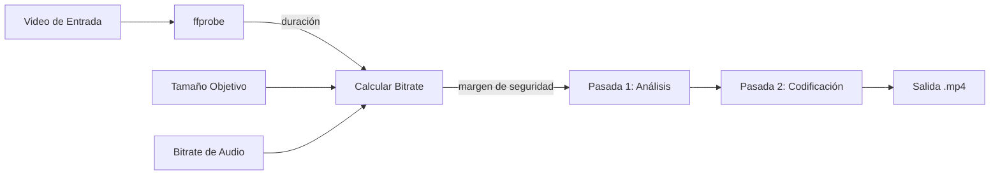

# ffmpeg-video-filesize

[](LICENSE)
[](https://github.com/andreswatson/ffmpeg-video-filesize/actions/workflows/lint.yml)
[]()
[](https://ffmpeg.org)

Idioma: [English](README.md) | Español

Utilidad en Bash que comprime un video para que entre dentro de un tamaño de archivo objetivo usando codificación `ffmpeg` en dos pasadas.

## TL;DR

Le das a este script un video y un tamaño objetivo. Calcula el bitrate necesario y produce un archivo `.mp4` con H.264 + AAC cerca de ese tamaño.

```bash
./ffmpeg-filesize.sh input.mov 25mb
./ffmpeg-filesize.sh --template gmail input.mov
./ffmpeg-filesize.sh --output final.mp4 input.mov 24mb
```

Si con esto te alcanza, copiá un comando y listo. La documentación completa sigue abajo.

---

## Tabla de Contenidos

- [Qué Hace](#qué-hace)
- [Cómo Funciona](#cómo-funciona)
- [Requisitos](#requisitos)
- [Instalación](#instalación)
- [Uso](#uso)
- [Opciones](#opciones)
- [Targets por Plataforma](#targets-por-plataforma)
- [Ejemplos](#ejemplos)
- [Formatos de Entrada y Salida](#formatos-de-entrada-y-salida)
- [Resultados Reales](#resultados-reales)
- [Avanzado: GPU en macOS](#avanzado-gpu-en-macos)
- [Notas Importantes](#notas-importantes)
- [Ver También](#ver-también)
- [Créditos](#créditos)
- [Licencia](#licencia)

---

## Qué Hace

Le das al script:

1. Un archivo de video local
2. Un tamaño objetivo como `25mb`, `1gb` o `800kb`

El script:

1. Mide la duración del video con `ffprobe`
2. Calcula el presupuesto total de bitrate para el tamaño pedido
3. Reserva una porción para audio (AAC, configurable)
4. Codifica el video con `ffmpeg` en dos pasadas
5. Genera un `.mp4` cerca del tamaño objetivo

Si el archivo original ya es más chico que el objetivo, el script se detiene y te avisa.

---

## Cómo Funciona



El script estima el bitrate total a partir de `tamaño objetivo / duración`, aplica un margen de seguridad del 2%, resta el bitrate de audio y usa el resto para video. La codificación en dos pasadas distribuye los bits de forma más inteligente entre escenas, haciendo que el tamaño final sea más predecible que con una sola pasada.

---

## Requisitos

- `bash`
- `ffmpeg` (incluye `ffprobe`)

```bash
ffmpeg -version
ffprobe -version
```

---

## Instalación

### Instalación rápida (un comando)

```bash
curl -sSL https://raw.githubusercontent.com/andreswatson/ffmpeg-video-filesize/master/ffmpeg-filesize.sh -o /usr/local/bin/ffmpeg-filesize && chmod +x /usr/local/bin/ffmpeg-filesize
```

### Clonar el repositorio

```bash
git clone https://github.com/andreswatson/ffmpeg-video-filesize.git
cd ffmpeg-video-filesize
chmod +x ffmpeg-filesize.sh
```

### macOS: instalar ffmpeg vía Homebrew

```bash
brew install ffmpeg
```

Homebrew instala tanto `ffmpeg` como `ffprobe`.

Verificar que todo esté listo:

```bash
ffmpeg -version
./ffmpeg-filesize.sh --version
```

---

## Uso

```bash
./ffmpeg-filesize.sh <archivo-entrada> <tamaño-objetivo>
```

Formatos de tamaño objetivo:

| Formato | Significado |
|---------|-------------|
| `25` | 25 MB |
| `25mb` | 25 MB |
| `800kb` | 800 KB |
| `1gb` | 1 GB |
| `1.5gb` | 1.5 GB |

Un número sin sufijo se interpreta como MB. Los sufijos no distinguen mayúsculas (`MB`, `mb`, `Mb` funcionan igual).

---

## Opciones

| Flag | Descripción | Default |
|------|-------------|---------|
| `-o, --output <ruta>` | Ruta del archivo de salida | `<input>-<size>.mp4` |
| `-a, --audio-bitrate <kbps>` | Bitrate AAC de audio en kbps (0 = sin audio) | `128` |
| `-e, --video-encoder <nombre>` | Nombre del encoder de video | `libx264` |
| `-g, --gpu` | Usar VideoToolbox H.264 en macOS | off |
| `-p, --preset <preset>` | Preset del encoder | `medium` |
| `-f, --force` | Sobrescribir si el archivo ya existe | off |
| `-t, --template <nombre>` | Usar un preset de tamaño integrado (ver abajo) | -- |
| `-v, --version` | Mostrar versión | -- |
| `-h, --help` | Mostrar ayuda | -- |

---

## Targets por Plataforma

Templates integrados para plataformas comunes. Usá `--template` o pasá el tamaño directamente.

| Plataforma | Template | Tamaño | Límite Oficial | Comando |
|------------|----------|--------|----------------|---------|
| WhatsApp media | `whatsapp-safe` | 60 MB | ~100 MB | `./ffmpeg-filesize.sh -t whatsapp-safe input.mov` |
| WhatsApp HD | `whatsapp` | 95 MB | ~100 MB | `./ffmpeg-filesize.sh -t whatsapp input.mov` |
| Gmail adjunto | `gmail` | 24 MB | 25 MB | `./ffmpeg-filesize.sh -t gmail input.mov` |
| Email general | `email` | 20 MB | varía | `./ffmpeg-filesize.sh -t email input.mov` |
| Preview móvil | `mobile` | 16 MB | -- | `./ffmpeg-filesize.sh -t mobile input.mov` |
| Preview rápido | `preview` | 8 MB | -- | `./ffmpeg-filesize.sh -t preview input.mov` |

Los targets seguros están por debajo de los límites oficiales porque la codificación real puede quedar un poco por encima del tamaño pedido.

Links de referencia (los límites pueden cambiar):
- [WhatsApp Help Center](https://faq.whatsapp.com/453914586839706/?locale=en_US&cms_platform=web)
- [Gmail Help](https://support.google.com/mail/answer/6584?hl=en-GB&co=GENIE.Platform=Desktop)

---

## Ejemplos

Comprimir a unos 25 MB:

```bash
./ffmpeg-filesize.sh input.mov 25mb
```

Usar un template integrado:

```bash
./ffmpeg-filesize.sh --template gmail input.mov
```

Bajar el bitrate de audio para darle más espacio al video:

```bash
./ffmpeg-filesize.sh --audio-bitrate 96 input.mov 12mb
```

Preset más lento para mejor eficiencia de compresión:

```bash
./ffmpeg-filesize.sh --preset slow input.mov 15mb
```

Ruta de salida personalizada:

```bash
./ffmpeg-filesize.sh --output exported/final.mp4 input.mov 700mb
```

Eliminar el audio por completo:

```bash
./ffmpeg-filesize.sh --audio-bitrate 0 input.mov 6mb
```

---

## Formatos de Entrada y Salida

| Tipo | Formatos Soportados |
|------|---------------------|
| Video de entrada | `mp4`, `mov`, `mkv`, `avi`, `m4v`, `webm` (cualquiera que `ffmpeg` pueda leer) |
| Salida por defecto | `.mp4` (H.264 + AAC) |
| Salida personalizada | Cualquier contenedor que `ffmpeg` soporte vía `--output` (ej. `.mov`) |

La entrada puede ser cualquier formato que `ffmpeg` pueda leer. La salida por defecto siempre es `.mp4`. Usá `--output` para controlar el nombre y contenedor:

```bash
./ffmpeg-filesize.sh --output final.mov input.mp4 1gb
```

Para conversión de formatos, extracción de audio y creación de GIFs con `ffmpeg`, ver [docs/ffmpeg-recipes.es.md](docs/ffmpeg-recipes.es.md).

---

## Resultados Reales

Probado con `Rick Astley - Never Gonna Give You Up` (63.5 MB, AV1, 1920x1440, 3:32):

| Target | Tamaño Real | Precisión |
|--------|-------------|-----------|
| `24mb` (Gmail) | 23.97 MB | 99.9% |
| `50mb` (General) | 49.56 MB | 99.1% |
| `60mb` (WhatsApp safe) | 59.41 MB | 99.0% |

Todas las pruebas usaron configuración por defecto (`libx264`, preset `medium`, audio AAC 128 kbps).

### Ejemplo de GIF Liviano para Email

El GIF de abajo se generó a partir del mismo video fuente usando `ffmpeg` puro y se mantuvo por debajo de 1 MB:


Clip MP4 directo: [assets/rick-astley-preview.mp4](assets/rick-astley-preview.mp4)

El GIF pesa unos 1.7 MB (600px de ancho). Para la receta completa, ver [docs/ffmpeg-recipes.es.md](docs/ffmpeg-recipes.es.md#ejemplo-de-gif-liviano-para-email).

---

## Avanzado: GPU en macOS

En macOS, podés usar Apple VideoToolbox para codificación asistida por hardware:

```bash
./ffmpeg-filesize.sh --gpu input.mov 50mb
./ffmpeg-filesize.sh --video-encoder h264_videotoolbox input.mov 50mb
```

### Benchmark real

Mismo video, mismo target (`25mb`), misma Mac:

| Encoder | Tiempo | Tamaño de Salida | Notas |
|---------|--------|-------------------|-------|
| `libx264` (CPU) | ~40s | 24.94 MB | Dentro del target |
| `h264_videotoolbox` (GPU) | ~71s | 26.29 MB | Se pasó del target |

Para flujos estrictos de tamaño objetivo, `libx264` (CPU) es el default recomendado. La codificación GPU puede ser útil para velocidad en otros escenarios, pero para este caso específico de two-pass orientado a tamaño, CPU fue tanto más rápida como más precisa en las pruebas reales.

---

## Notas Importantes

- El tamaño final es aproximado, no está garantizado que coincida exactamente con el valor pedido
- Si el archivo de entrada ya está por debajo del target, el script termina antes
- Targets muy chicos en videos largos pueden dar mala calidad o fallar
- Para límites estrictos de plataforma, apuntá por debajo del máximo oficial
- Los presets (`--preset`) solo aplican a `libx264`; VideoToolbox los ignora
- Los tamaños aceptan sufijos `kb`, `mb`, `gb`, sin importar mayúsculas

---

## Ver También

- [Recetas y Referencia de Formatos FFmpeg](docs/ffmpeg-recipes.es.md) -- conversión de formatos, extracción de audio, creación de GIFs
- [Contributing](CONTRIBUTING.md)

---

## Créditos

Creado por Andres Watson. LinkedIn: [https://linkedin.com/in/andreswatson](https://linkedin.com/in/andreswatson)

Originalmente armado en una etapa pre-LLM / pre-AI-coding-tools como un flujo práctico de shell para un problema real de tamaño de archivos. Este repositorio muestra una forma directa de resolverlo con `ffmpeg` y `ffprobe`.

---

## Licencia

Este proyecto está publicado bajo la licencia MIT. Ver [LICENSE](LICENSE).
