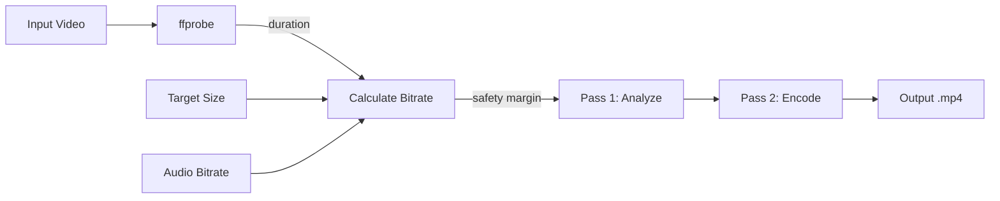

# ffmpeg-video-filesize

[](LICENSE)
[](https://github.com/andreswatson/ffmpeg-video-filesize/actions/workflows/lint.yml)
[]()
[](https://ffmpeg.org)

Language: English | [Español](README.es.md)

A Bash utility that compresses a video to fit within a target file size using two-pass `ffmpeg` encoding.

## TL;DR

Give this script a video and a target size. It calculates the bitrate needed and produces an H.264 + AAC `.mp4` file close to that size.

```bash
./ffmpeg-filesize.sh input.mov 25mb
./ffmpeg-filesize.sh --template gmail input.mov
./ffmpeg-filesize.sh --output final.mp4 input.mov 24mb
```

If this is all you need, copy one command and go. Full documentation below.

---

## Table of Contents

- [What It Does](#what-it-does)
- [How It Works](#how-it-works)
- [Requirements](#requirements)
- [Installation](#installation)
- [Usage](#usage)
- [Options](#options)
- [Platform Targets](#platform-targets)
- [Examples](#examples)
- [Input and Output Formats](#input-and-output-formats)
- [Real-World Results](#real-world-results)
- [Advanced: GPU on macOS](#advanced-gpu-on-macos)
- [Important Notes](#important-notes)
- [See Also](#see-also)
- [Credits](#credits)
- [License](#license)

---

## What It Does

You give the script:

1. A local video file
2. A target size such as `25mb`, `1gb`, or `800kb`

The script:

1. Measures the video duration with `ffprobe`
2. Calculates the total bitrate budget for the requested file size
3. Reserves a portion for audio (AAC, configurable)
4. Encodes the video using two-pass `ffmpeg`
5. Produces a `.mp4` file close to the target size

If the original file is already smaller than the target, the script stops and tells you.

---

## How It Works



The script estimates the total bitrate from `target size / duration`, applies a 2% safety margin, subtracts the audio bitrate, and uses the remainder for video. Two-pass encoding distributes bits more intelligently across scenes, making the final size more predictable than single-pass.

---

## Requirements

- `bash`
- `ffmpeg` (includes `ffprobe`)

```bash
ffmpeg -version
ffprobe -version
```

---

## Installation

### Quick install (one command)

```bash
curl -sSL https://raw.githubusercontent.com/andreswatson/ffmpeg-video-filesize/master/ffmpeg-filesize.sh -o /usr/local/bin/ffmpeg-filesize && chmod +x /usr/local/bin/ffmpeg-filesize
```

### Clone the repository

```bash
git clone https://github.com/andreswatson/ffmpeg-video-filesize.git
cd ffmpeg-video-filesize
chmod +x ffmpeg-filesize.sh
```

### macOS: install ffmpeg via Homebrew

```bash
brew install ffmpeg
```

Homebrew installs both `ffmpeg` and `ffprobe`.

Verify everything is ready:

```bash
ffmpeg -version
./ffmpeg-filesize.sh --version
```

---

## Usage

```bash
./ffmpeg-filesize.sh <input-file> <target-size>
```

Target size formats:

| Format | Meaning |
|--------|---------|
| `25` | 25 MB |
| `25mb` | 25 MB |
| `800kb` | 800 KB |
| `1gb` | 1 GB |
| `1.5gb` | 1.5 GB |

A plain number without a suffix is treated as MB. Suffixes are case-insensitive (`MB`, `mb`, `Mb` all work).

---

## Options

| Flag | Description | Default |
|------|-------------|---------|
| `-o, --output <path>` | Output file path | `<input>-<size>.mp4` |
| `-a, --audio-bitrate <kbps>` | AAC audio bitrate in kbps (0 = no audio) | `128` |
| `-e, --video-encoder <name>` | Video encoder name | `libx264` |
| `-g, --gpu` | Use macOS VideoToolbox H.264 | off |
| `-p, --preset <preset>` | Encoder preset | `medium` |
| `-f, --force` | Overwrite existing output | off |
| `-t, --template <name>` | Use a built-in size preset (see below) | -- |
| `-v, --version` | Show version | -- |
| `-h, --help` | Show help | -- |

---

## Platform Targets

Built-in templates for common sharing platforms. Use `--template` or pass the size directly.

| Platform | Template Name | Target Size | Official Limit | Command |
|----------|--------------|-------------|----------------|---------|
| WhatsApp media | `whatsapp-safe` | 60 MB | ~100 MB | `./ffmpeg-filesize.sh -t whatsapp-safe input.mov` |
| WhatsApp HD | `whatsapp` | 95 MB | ~100 MB | `./ffmpeg-filesize.sh -t whatsapp input.mov` |
| Gmail attachment | `gmail` | 24 MB | 25 MB | `./ffmpeg-filesize.sh -t gmail input.mov` |
| Email-friendly | `email` | 20 MB | varies | `./ffmpeg-filesize.sh -t email input.mov` |
| Mobile preview | `mobile` | 16 MB | -- | `./ffmpeg-filesize.sh -t mobile input.mov` |
| Quick preview | `preview` | 8 MB | -- | `./ffmpeg-filesize.sh -t preview input.mov` |

Safe targets are set below the official platform limits because real-world encoding can land slightly above the requested size.

Reference links (limits can change over time):
- [WhatsApp Help Center](https://faq.whatsapp.com/453914586839706/?locale=en_US&cms_platform=web)
- [Gmail Help](https://support.google.com/mail/answer/6584?hl=en-GB&co=GENIE.Platform=Desktop)

---

## Examples

Compress to about 25 MB:

```bash
./ffmpeg-filesize.sh input.mov 25mb
```

Use a built-in template:

```bash
./ffmpeg-filesize.sh --template gmail input.mov
```

Lower audio bitrate for more video room:

```bash
./ffmpeg-filesize.sh --audio-bitrate 96 input.mov 12mb
```

Slower preset for better compression efficiency:

```bash
./ffmpeg-filesize.sh --preset slow input.mov 15mb
```

Custom output path:

```bash
./ffmpeg-filesize.sh --output exported/final.mp4 input.mov 700mb
```

Remove audio completely:

```bash
./ffmpeg-filesize.sh --audio-bitrate 0 input.mov 6mb
```

---

## Input and Output Formats

| Type | Supported Formats |
|------|-------------------|
| Video input | `mp4`, `mov`, `mkv`, `avi`, `m4v`, `webm` (anything `ffmpeg` can read) |
| Default output | `.mp4` (H.264 + AAC) |
| Custom output | Any container `ffmpeg` supports via `--output` (e.g. `.mov`) |

The input can be any format `ffmpeg` can read. The default output is always `.mp4`. Use `--output` to control the filename and container:

```bash
./ffmpeg-filesize.sh --output final.mov input.mp4 1gb
```

For general `ffmpeg` format conversion, audio extraction, and GIF creation, see [docs/ffmpeg-recipes.md](docs/ffmpeg-recipes.md).

---

## Real-World Results

Tested with `Rick Astley - Never Gonna Give You Up` (63.5 MB, AV1, 1920x1440, 3:32):

| Target | Actual Size | Accuracy |
|--------|-------------|----------|
| `24mb` (Gmail) | 23.97 MB | 99.9% |
| `50mb` (General) | 49.56 MB | 99.1% |
| `60mb` (WhatsApp safe) | 59.41 MB | 99.0% |

All tests used default settings (`libx264`, `medium` preset, 128 kbps AAC audio).

### Email-Safe GIF Example

The GIF below was generated from the same source video using plain `ffmpeg` and kept under 1 MB:


Direct MP4 clip: [assets/rick-astley-preview.mp4](assets/rick-astley-preview.mp4)

The GIF is about 756 KB. For the full recipe, see [docs/ffmpeg-recipes.md](docs/ffmpeg-recipes.md#email-safe-gif-example).

---

## Advanced: GPU on macOS

On macOS, you can use Apple VideoToolbox for hardware-assisted encoding:

```bash
./ffmpeg-filesize.sh --gpu input.mov 50mb
./ffmpeg-filesize.sh --video-encoder h264_videotoolbox input.mov 50mb
```

### Real benchmark

Same video, same target (`25mb`), same Mac:

| Encoder | Time | Output Size | Notes |
|---------|------|-------------|-------|
| `libx264` (CPU) | ~40s | 24.94 MB | Within target |
| `h264_videotoolbox` (GPU) | ~71s | 26.29 MB | Overshot target |

For strict size-targeted workflows, `libx264` (CPU) is the recommended default. GPU encoding can be useful for speed in other scenarios, but for this specific two-pass size-targeting use case, CPU was both faster and more accurate in real tests.

---

## Important Notes

- The final file size is approximate, not guaranteed to match the exact requested value
- If the input file is already below the target, the script exits early
- Very small targets on long videos may produce poor quality or fail
- For strict platform limits, aim below the official maximum
- Presets (`--preset`) only apply to `libx264`; VideoToolbox ignores them
- Target sizes accept `kb`, `mb`, `gb` suffixes, case-insensitively

---

## See Also

- [FFmpeg Recipes and Format Reference](docs/ffmpeg-recipes.md) -- format conversion, audio extraction, GIF creation
- [Contributing](CONTRIBUTING.md)

---

## Credits

Created by Andres Watson. LinkedIn: [https://linkedin.com/in/andreswatson](https://linkedin.com/in/andreswatson)

Originally built in a pre-LLM / pre-AI-coding-tools era as a practical shell workflow for a real file-size problem. This repository shows one straightforward way to do it with `ffmpeg` and `ffprobe`.

---

## License

Licensed under the MIT License. See [LICENSE](LICENSE).
